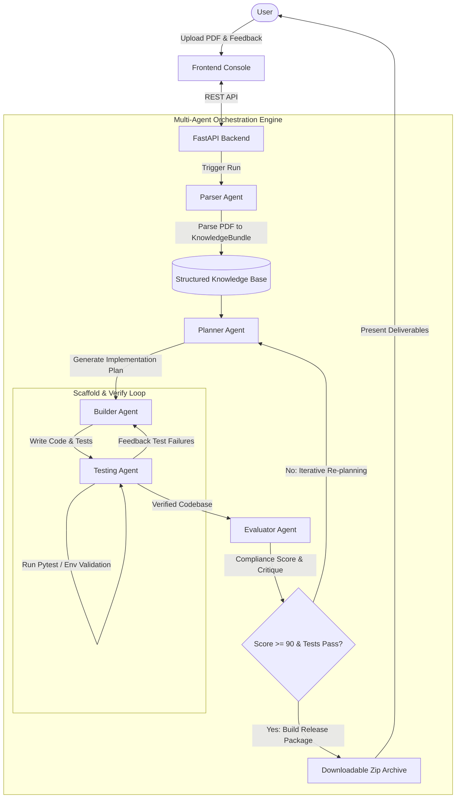

# Research Paper Replicator 🚀

An enterprise-grade, multi-agent AI system designed to automatically replicate Computer Vision research paper architectures and implementations. The platform ingests research paper PDFs, builds structured knowledge graphs, plans code structure, generates scaffolding, runs test suites, and evaluates implementation compliance—all locally and privately.

---

## 🏗️ System Architecture

The platform utilizes a collaborative multi-agent architecture orchestrated via a stateful execution graph (conceptualized using LangGraph). 



### The Agent Squad
*   **Parser Agent ([PaperParserAgent](file:///backend/app/agents/parser/agent.py))**: Extracts mathematical formulations, model layers, training hyper-parameters, and network topology directly from the research PDF.
*   **Planner Agent ([PlannerAgent](file:///backend/app/agents/planner/agent.py))**: Generates an implementation strategy based on parsed knowledge, evaluation results, and human feedback.
*   **Builder Agent ([BuilderAgent](file:///backend/app/agents/builder/agent.py))**: Generates code, constructs file systems, creates virtual environments, and sets up project boilerplates.
*   **Testing Agent ([TestingAgent](file:///backend/app/agents/tester/agent.py))**: Runs unit tests and validates packages in isolated sandboxed virtual environments.
*   **Evaluator Agent ([EvaluatorAgent](file:///backend/app/agents/evaluator/agent.py))**: Performs semantic code verification against parsed paper formulas and assigns a completeness score (0-100).
*   **Orchestrator ([run_replication](file:///backend/app/orchestrator/graph.py))**: Drives execution flow, handles state caching, loops execution through self-correction pipelines, and supports human-in-the-loop interventions.

---

## 🤖 Local LLM Execution with Ollama

The system is built to run fully locally, ensuring 100% data privacy and zero API costs. It utilizes **Ollama** for hosting open-weights LLMs (defaulting to `qwen3:8b` or `qwen2.5-coder`).

### Features of the LLM Engine:
*   **LangChain ChatOllama Integration**: Built-in adapter for LangChain-orchestrated LLM prompts.
*   **Reasoning Strip Hook**: Custom parsing regex to strip `<think>...</think>` thinking tokens emitted by reasoning models (like DeepSeek-R1 or Qwen-2.5-Coder-Instruct) for clean API responses.
*   **JSON Enforcement**: Native JSON response structures mapping back to Pydantic domain models.
*   **Fault-Tolerant Retries**: Automatic exponential backoff retrying on LLM rate limits or connection failures.

---

## 🛠️ Technology Stack

| Layer | Technologies |
| :--- | :--- |
| **Frontend** | React 19, Next.js 15 (App Router), TailwindCSS, TypeScript, Lucide Icons |
| **Backend** | FastAPI, Pydantic v2, Python 3.11+, Structlog |
| **LLM Orchestration** | LangChain Core, LangChain Ollama, LangGraph (Stub Visualization) |
| **Data & Caching** | PostgreSQL 16, Redis 7, Qdrant Vector DB (Optional for Memory) |

---

## 🚀 Quick Start

### 1. Prerequisites
Make sure you have [Docker](https://www.docker.com/) and [Ollama](https://ollama.com/) installed on your machine.

#### Setting up Ollama
Ensure the Ollama service is running on your machine:
```bash
# Pull the default reasoning/coding model
ollama pull qwen3:8b
```
*(Alternatively, pull a coding-specific model like `ollama pull qwen2.5-coder:7b` and update the environment config).*

---

### 2. Docker Compose Setup (Recommended)
You can launch the entire stack (Frontend, Backend, Database, Redis Cache) with one command.

Create a `.env` file in the root directory (copied from `.env.example`):
```bash
cp .env.example .env
```

Start the containers:
```bash
docker compose up --build
```

Access the services:
*   **Frontend Console**: `http://localhost:3000`
*   **FastAPI backend**: `http://localhost:8000/docs`
*   **Postgres Database**: `localhost:5432`
*   **Redis Cache**: `localhost:6379`

---

### 3. Local Development Setup (Manual)

If you prefer to run services manually for debugging or active development:

#### A. Configure Environment
Create a `.env` file in the root workspace and adjust properties if needed.
```ini
APP_NAME="Research Paper Replicator"
ENVIRONMENT=development
CORS_ORIGINS='["http://localhost:3000"]'
GENERATED_ROOT=generated
MAX_ITERATIONS=3

# Local Ollama Details
LLM_MODEL=ollama/qwen3:8b
OLLAMA_BASE_URL=http://localhost:11434
LLM_TIMEOUT=120
LLM_RETRIES=3
```

#### B. Run the FastAPI Backend
```bash
cd backend
python -m venv .venv

# Windows activation
.venv\Scripts\activate
# Linux/macOS activation
source .venv/bin/activate

pip install -r requirements.txt
pip install -r requirements-llm.txt  # Installs LangChain Ollama dependencies

uvicorn app.main:app --reload
```

#### C. Run the Next.js Frontend
```bash
cd frontend
npm install
npm run dev
```
Open `http://localhost:3000` in your browser.

---

## 📂 Repository Structure

```text
├── backend/
│   ├── app/
│   │   ├── agents/          # Agent implementations (Parser, Planner, Builder, etc.)
│   │   ├── api/             # FastAPI route declarations & controller logics
│   │   ├── core/            # Configuration loaders and logging setups
│   │   ├── domain/          # Pydantic data schemas & domains
│   │   ├── orchestrator/    # LangGraph agent-orchestrator loop
│   │   └── services/        # Ollama LLM clients, Storage drivers, and Venv Managers
│   └── tests/               # Backend testing suites
├── frontend/
│   ├── app/                 # Next.js App Router Pages and Globals
│   ├── components/          # Reusable React components (Agent Monitors, Panels)
│   ├── lib/                 # API connection clients
│   └── types/               # Type declarations for API boundaries
├── docker-compose.yml       # Production-like multi-container compose configuration
└── README.md                # System documentation
```

---

## 📦 Generated Artifacts

Every replication task writes structured data to `backend/generated/<run-id>/`:
```text
generated/<run-id>/
├── input/
│   └── paper.pdf                  # The uploaded target paper
├── knowledge/
│   └── *.json                     # Extracted model architectures and parameters
├── project/                       # The generated, validated python project
├── checkpoints/
│   └── *.json                     # Orchestrator snapshots at each step
└── archives/
    └── replicated-project.zip     # Compressed release ready for deployment
```

---

## 🧪 Validation & Quality Checks

Run backend tests:
```bash
cd backend
pytest
```

Run frontend build and typechecks:
```bash
cd frontend
npm run typecheck
npm run build
```

---

## 🛡️ Scope and Disclaimer

This project generates **software implementation scaffolding** only.
*   It **does not** auto-download custom datasets, train network parameters from scratch, perform hyper-parameter sweeps, or reproduce bench-marking tables automatically.
*   Its primary goal is to accelerate developers by converting academic papers into structurally sound, fully typed, compile-ready repository architectures with template code, unit tests, and validation files.
